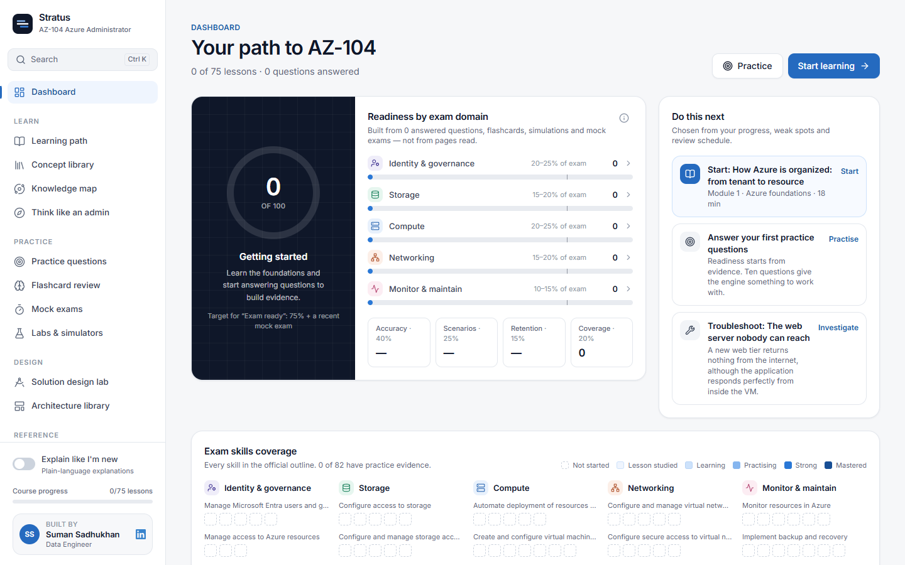
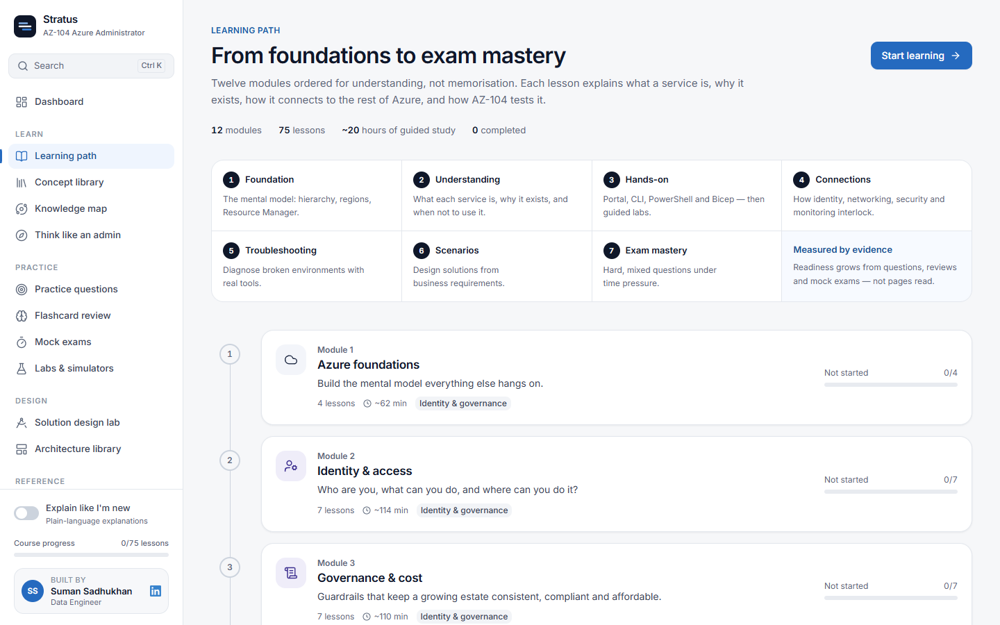
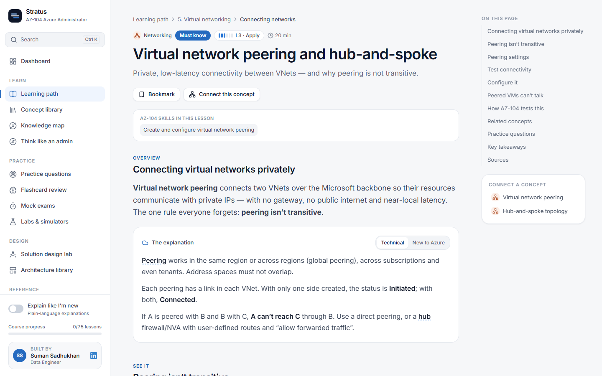
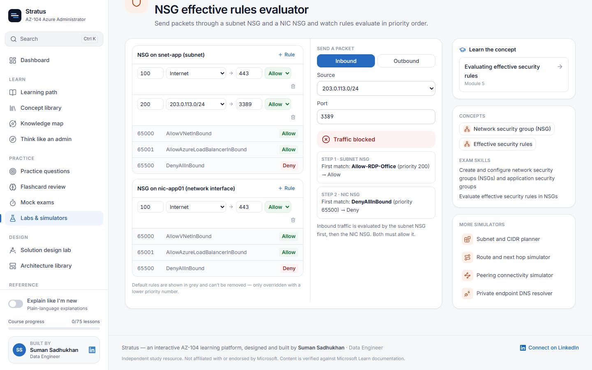
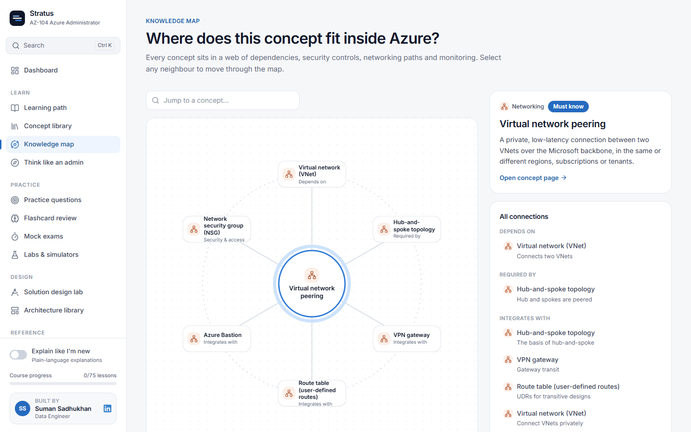
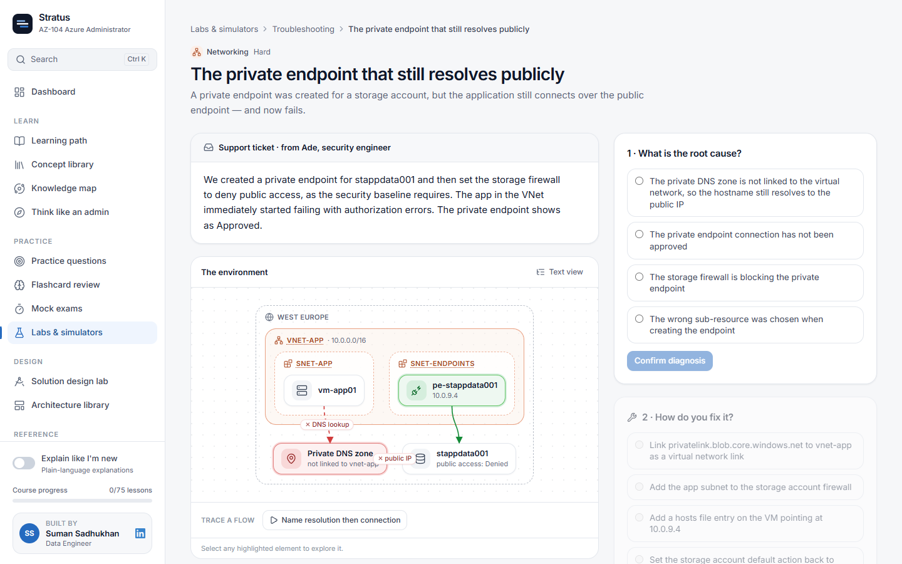
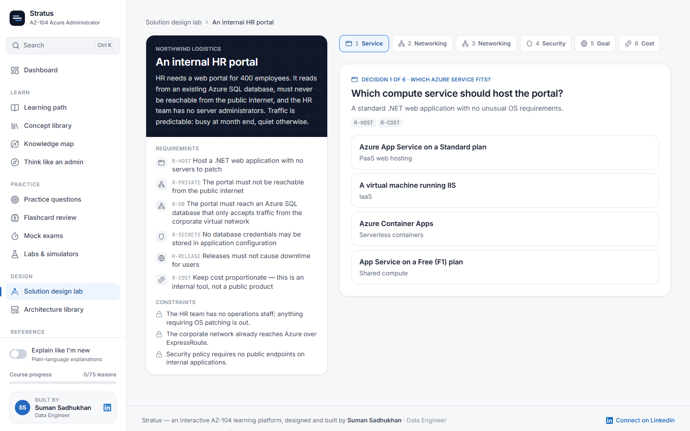
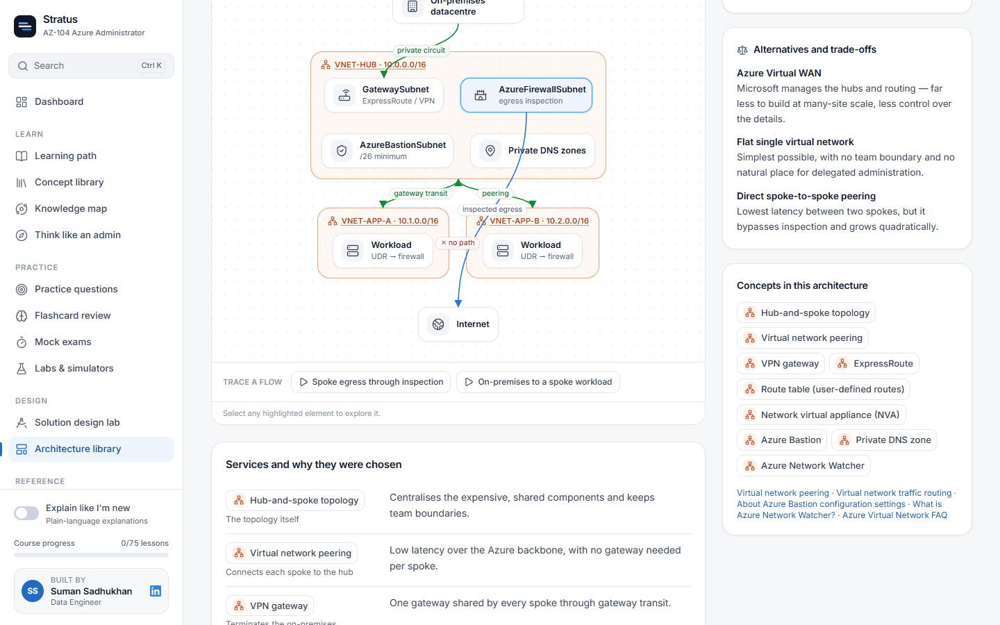
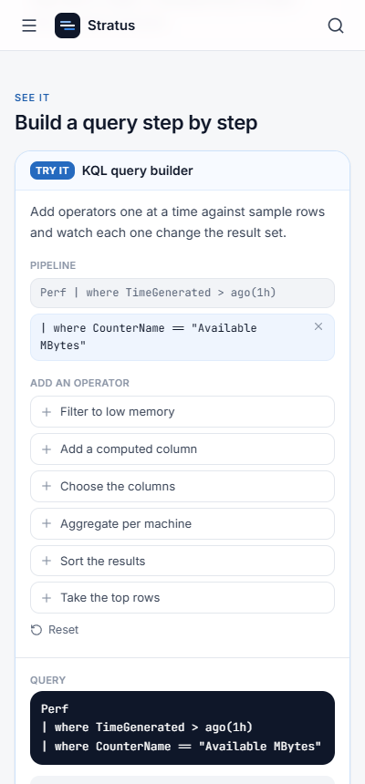

<div align="center">

# ☁️ Stratus

### An interactive university for **Microsoft AZ-104: Azure Administrator**

Learn how Azure actually works, break things safely in simulators, connect every concept to the ones around it,<br/>and measure exam readiness from evidence — not from pages read.

<br/>


**Built by [Suman Sadhukhan](https://www.linkedin.com/in/sumandataenthusiast/) · Data Engineer**

[](https://www.linkedin.com/in/sumandataenthusiast/)

<br/>



</div>

---

## Why Stratus exists

Most AZ-104 preparation is a question bank with a progress bar. You memorise that "VNet integration" is the answer, pass a practice test, and still can't explain why a private endpoint didn't fix your connectivity problem.

Stratus is built the other way round. It teaches the **mental model** first, makes you **use it** in simulators and troubleshooting tickets, shows how every service **connects** to identity, networking, monitoring and governance, and only then asks exam questions. Readiness is calculated from what you can demonstrably do — reading a lesson moves the needle by exactly zero.

---

## ✨ At a glance

<table>
<tr>
<td align="center"><b>12</b><br/>modules</td>
<td align="center"><b>75</b><br/>lessons</td>
<td align="center"><b>119</b><br/>connected concepts</td>
<td align="center"><b>169</b><br/>exam-style questions</td>
<td align="center"><b>163</b><br/>flashcards</td>
</tr>
<tr>
<td align="center"><b>20</b><br/>interactive simulators</td>
<td align="center"><b>10</b><br/>guided Azure labs</td>
<td align="center"><b>8</b><br/>troubleshooting tickets</td>
<td align="center"><b>6</b><br/>design challenges</td>
<td align="center"><b>7</b><br/>reference architectures</td>
</tr>
</table>

Every lesson, question and architecture cites the **101 Microsoft Learn pages** it was written from, with each page's own last-updated date recorded.

---

## 🎓 What's inside

### A learning path ordered for understanding

Twelve modules move from foundations to exam mastery — identity, governance, storage, networking, virtual machines, infrastructure as code, App Service, containers, monitoring, and backup & recovery. Each lesson explains what a service is, why it exists, how to configure it (portal, Azure CLI, PowerShell and Bicep), the mistakes people make, and exactly how AZ-104 tests it.



### Lessons that switch between two voices

Every explanation has a **Technical** version and a **New to Azure** version, toggled globally with *Explain like I'm new*. Inline concept links open a side sheet, and **Connect this concept** jumps straight into the knowledge map.



### 20 simulators for the rules the exam actually tests

Evaluate RBAC across scopes, order NSG rules and watch a packet get evaluated, plan subnets, route traffic through UDRs, tier blobs, build a SAS, break a load balancer health probe, flap an autoscale rule, run a complete-mode deployment and see what it deletes, swap deployment slots, build KQL step by step, and replay incidents against backup and disaster recovery.



### A knowledge graph, not a glossary

Each concept declares what it **depends on**, **integrates with**, and how it relates to **security**, **networking**, **monitoring** and **governance**. The map lets you walk from any service to everything around it.



### Troubleshooting tickets with real diagnostic tools

A support ticket arrives. You open NSG rules, IP flow verify, effective routes, DNS lookups and the activity log — one of them holds the decisive clue — then commit to a root cause and a fix. Scoring rewards reasoning over clicking everything.



### Think like an administrator

The **Solution Design Lab** hands you a business brief, requirements and constraints, then walks you through decisions — service, network, security, cost — scored best, defensible or wrong, with a reference solution at the end. The **Architecture Library** examines seven real designs through the same six lenses.

<table>
<tr>
<td width="50%"></td>
<td width="50%"></td>
</tr>
</table>

### Practice, review and mock exams

- **169 questions** in five formats — single, multi-select, yes/no statements, drag-to-order and matching — each with an explanation for **every** option, the concept tested, the real-world relevance and the exam trap.
- **Spaced-repetition flashcards** scheduled with SM-2.
- **Mock exams** weighted like the official outline, with a per-domain breakdown and a revision plan.
- **10 guided labs** for a real subscription, each with verification steps, honest cost estimates and full clean-up.

### Works on your phone

Desktop-first for diagrams and simulators, but every page reflows to a single column at phone width.

<p align="center"></p>

---

## 📊 Readiness that can't be gamed

```
score = (accuracy × 0.40 + scenarios × 0.25 + retention × 0.15 + coverage × 0.20)
        × (0.35 + 0.65 × evidence)
```

- **Evidence** scales the whole score — with no answered questions, readiness stays near zero however many lessons are open.
- Mastery uses a **21-day recency half-life** and **Bayesian shrinkage**, so three lucky answers aren't mastery.
- Readiness is **capped at 72 %** until you sit a recent mock exam; *Exam ready* needs ≥ 75 % overall **and** a recent mock ≥ 75 %.

---

## 🛡️ Accuracy is the first priority

The build order was **Accuracy → Understanding → Practical ability → Concept connections → Exam mastery → UX.**

1. **Research before writing.** Facts were extracted from Microsoft Learn into a research ledger (`docs/validation/research-ledger/`) before any lesson was written.
2. **Cite everything.** 101 registered sources, each with the page's own update date and the date Stratus verified it.
3. **Never invent.** No made-up features, CLI parameters, limits or prices. Anything that couldn't be confirmed is hedged or left out.
4. **Flag what changed.** Where current Azure behaviour differs from older study material (e.g. complete deployment mode, linked-database backups, the Enhanced VM backup policy), the lesson says so explicitly.
5. **Machine-checked integrity.** `npm run validate:content` fails the build if any concept link, source, question option explanation, skill mapping, simulator or diagram reference is broken — and if any official exam skill isn't both taught **and** practised.

Details: [docs/CONTENT_VALIDATION.md](docs/CONTENT_VALIDATION.md)

---

## 🚀 Getting started

**Requirements:** Node.js 22 or later.

```bash
git clone https://github.com/techysuman27/AZ-104-prep.git
cd AZ-104-prep
npm install
npm run dev
```

Open **http://localhost:5173**. Progress is stored locally in your browser — no account, no backend.

| Command | What it does |
| --- | --- |
| `npm run dev` | Start the dev server with hot reload |
| `npm run build` | Type-check and build for production into `dist/` |
| `npm run preview` | Serve the production build locally |
| `npm test` | Run all tests (engines + content integrity) |
| `npm run validate:content` | Content integrity checks only |
| `npm run lint` | ESLint |
| `npm run typecheck` | TypeScript without emitting |

The build is a static site, so it deploys to any static host (Azure Static Web Apps configuration is included in `public/`).

---

## 🧱 Tech stack

| Area | Choice |
| --- | --- |
| UI | React 19, TypeScript 5.9, Tailwind CSS 4 |
| Build | Vite 8 with route- and lesson-level code splitting |
| Routing | React Router 7 (data router, lazy routes) |
| State | Zustand with local persistence |
| Components | Radix UI primitives, Motion, lucide icons, cmdk command palette |
| Search | MiniSearch full-text index (`Ctrl + K`) |
| Code blocks | Shiki syntax highlighting (Bash, PowerShell, JSON, Bicep, KQL) |
| Drag and drop | dnd-kit, with a keyboard fallback |
| Testing | Vitest |

---

## 🗂️ Project structure

```
src/
├── app/            Router, app shell, sidebar, navigation model
├── components/
│   ├── content/        Block renderers — the lesson rendering engine
│   ├── diagrams/       Measured-edge architecture diagram renderer
│   ├── interactive/    The 20 simulators and their registry
│   └── questions/      Five question formats and the explanation panel
├── content/        ALL course content, as typed data
│   ├── concepts/       The knowledge graph
│   ├── lessons/        Lesson bodies, code-split per module
│   ├── questions/      Question banks by domain
│   ├── flashcards/ labs/ trouble/ design/ architectures/
│   └── __tests__/      Content integrity suite
├── engine/         Spaced repetition, grading, mastery, readiness, mock exams
├── features/       Page-level features
├── store/          Persisted progress
└── styles/         Design tokens
```

Content is **data, never markup inside components** — adding a lesson means adding a file, not editing UI code.

- [docs/ARCHITECTURE.md](docs/ARCHITECTURE.md) — how the app is put together and why
- [docs/CONTENT_GUIDE.md](docs/CONTENT_GUIDE.md) — how to add a lesson, question, simulator or lab
- [docs/CONTENT_VALIDATION.md](docs/CONTENT_VALIDATION.md) — the accuracy process

---

## ♿ Accessibility

- Every simulator result is announced via `aria-live`, and every control is keyboard-operable.
- Every diagram has a text view, so nothing is conveyed by the picture alone.
- Status is never colour-only — it always carries an icon and a label.
- Domain colours were validated for colour-vision-deficiency separation.

---

## 👤 About the creator

<table>
<tr>
<td>

**Suman Sadhukhan** — Data Engineer

I built Stratus to be the AZ-104 resource I wanted: one that explains *why* Azure behaves the way it does, lets you practise on realistic scenarios, and is honest about whether you're ready.

[](https://www.linkedin.com/in/sumandataenthusiast/)

If Stratus helped you prepare, I'd love to hear about it — connect with me on LinkedIn.

</td>
</tr>
</table>

---

<sub>Stratus is an independent study resource and is not affiliated with, sponsored by or endorsed by Microsoft. Microsoft, Azure and AZ-104 are trademarks of the Microsoft group of companies. Course content is written from and verified against public Microsoft Learn documentation; always confirm details against the current documentation and the official exam study guide.</sub>
